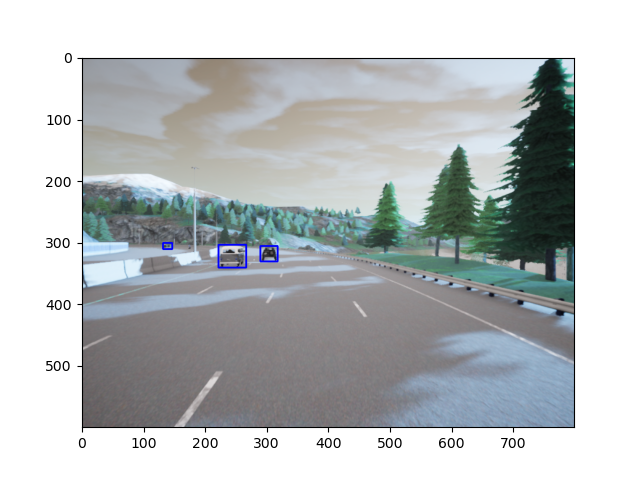

### Uncertainty-Aware Object Detection

This repository contains code for performing object-detection in perception component of the "Autonomous Driver Project" I am working on. This code is only for the block performing Object-Detection. 

The bounding boxes computed with this network must be fed as input into uncertainty computation neural network model which I am working on in this [{{REPOSITORY}}](https://github.com/Karthik-Ragunath/DDU/tree/feature/experiments). (Please do have a look at this repo too).

The code in this repository is also still a {{WORK-IN-PROGRESS}} as I am still experimenting with different neural network backbones to find the optimal one to be used.

### To train the model
```
python engine.py

```

### To perform inference
```
1.Push the test images to data/test_data
2. python inference.py
```

### Inference Example

